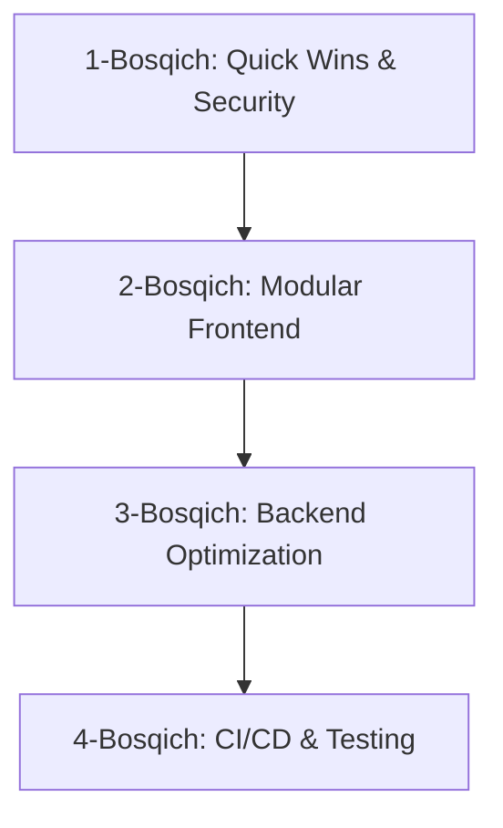

# 📊 ISHHAQIBOTTEST LOYIHASI — TO'LIQ TAHLIL VA YAXSHILASH TAKLIFLARI

**Tahlil Sanasi:** 2026-08-02  
**Loyiha:** `aka-FinGo/ishhaqibottest`  

---

## 1️⃣ LOYIHA HAQIDA UMUMIY MA'LUMOT VA ARXITEKTURA

**ishhaqibottest** — Telegram WebApp platformasida ishlaydigan xodimlarning ish haqi, avans/oylik to'lovlari, bajarilgan ishlar (kvadratlar), vazifalar (workflow) hamda lavozim ruxsatnomalarini boshqaruvchi Single Page Application (SPA).

* **Frontend:** Vanilla HTML5, CSS3 hamda 20 dan ortiq modulsiz JavaScript fayllar.
* **Backend:** Google Apps Script (`gsheetscode/` papkasida).
* **Database:** Google Sheets (Google Jadvallari).
* **Integratsiyalar:** Telegram WebApp SDK, Chart.js, SheetJS, Google Gemini / OpenRouter AI APIs.

---

## 2️⃣ QILINGAN TAHLIL VA MAVJUD MUAMMOLAR

### 🔴 A. Frontend va Arxitektura Muammolari:
1. **Global O'zgaruvchilar Xaosi (Namespace Pollution):**
   * `config.js` va boshqa 20+ JS fayllarda 100 dan ortiq global o'zgaruvchi (`window` obyektida) saqlanadi.
   * `import/export` (ES Modules) ishlatilmaydi, barcha fayllar `index.html` ichida script taglari orqali ketma-ket yuklanadi.
2. **N+1 API So'rovlar (Batching yo'qligi):**
   * Admin paneli ochilganda va tizimga kirilganda `getEmployees`, `getPositions`, `getWorkflow` so'rovlari alohida-alohida yuboriladi.
3. **Keshlashtirish Yetishmovchiligi:**
   * `kvadratlar.js` faylida `AppCache` ishlatilmaydi. Har safar tabga o'tilganda serverga yangi POST so'rov yuboriladi.
4. **Tashqi Iframe Bog'liqligi (`module_fl`):**
   * Modul tabida `https://aka-fingo.github.io/module_fl/` manziliga bog'liq iframe ishlatilgan. Agar internet uzilsa yoki GitHub Pages sekinlashsa, modul ishlamay qolishi mumkin.

### 🔴 B. Backend va Xavfsizlik Muammolari:
1. **Telegram Auth Check Yetarsizligi:**
   * `GS_Auth.gs` da kelgan `tgInitData` ma'lumotlari Telegram Bot Token bilan HMAC-SHA256 algoritmi orqali qat'iy va to'liq tekshirilmaydi.
2. **Google Apps Script va Sheets Cheklovlari:**
   * GAS so'rovlariga 6 soniyalik vaqt cheklovi bor. Foydalanuvchilar ko'payishi bilan `LockService` tufayli backend sekinlashadi.

### 🔴 C. DX va Testlar:
1. **Testlar yo'qligi:**
   * Butun loyihada faqat 1 ta unit test (`date-parse.test.js`) bor.
2. **Version Manual:**
   * `v=1.0.23` versiya raqamlari qo'lda har bir JS/CSS va html fayllarida o'zgartiriladi.

---

## 3️⃣ BOSQICHMA-BOSQICH YAXSHILASH PLAN (ROADMAP)



---

### 🟢 1-BOSQICH: TEZKOR VA MUHIM (QUICK WINS)

1. **API Request Batching (`admin_init` endpoint):**
   * Serverda `admin_init` actionini yaratib, barcha zaruriy ma'lumotlarni bitta so'rovda qaytarish:
   ```javascript
   // Backend (GAS):
   if (action === 'admin_init') {
     return sendJSON({
       employees: getEmployees_(),
       positions: getPositions_(),
       workflow: getWorkflow_(),
       settings: getSettings_()
     });
   }
   ```

2. **Telegram Auth Validation (HMAC-SHA256):**
   * Telegramdan kelgan `initData` ni bot tokeni bilan tekshirish:
   ```javascript
   function validateTelegramAuth(data, tgId) {
     // Bot token bilan hash ni solishtirish
   }
   ```

3. **`kvadratlar.js` ga Kesh Qo'shish:**
   * `AppCache.get('kvadratlar')` va `AppCache.set('kvadratlar', data, 300)` (5 minut TTL) qo'shish.

4. **`module_fl` Repozitoriyasini Mahalliylashtirish (Local Integration):**
   * External `https://aka-fingo.github.io/module_fl/` URL o'rniga loyihaning o'zidagi `./module_fl/index.html` katalogidan yuklash.

---

### 🟢 2-BOSQICH: FRONTEND ARXITEKTURASINI ZAMONAVIYLASHTIRISH

1. **Vite + Vanilla JS / React / Alpine.js Migratsiyasi:**
   * Loyihaga `package.json` va `vite` qo'shib, ES Modules (`import / export`) tizimiga o'tish.
2. **Centralized State Manager:**
   * Barcha global o'zgaruvchilarni yagona `AppState` obyektiga ko'chirish:
   ```javascript
   export const AppState = {
     user: null,
     role: 'User',
     permissions: {},
     records: [],
     // methods
   };
   ```

---

### 🟢 3-BOSQICH: BACKEND & DATABASE OPTIMIZATSIYA

1. **GAS CacheService:**
   * Tez-tez so'raladigan lavozimlar va sozlamalarni Google Apps Script `CacheService` ga 1 soatga saqlash.
2. **Baza Migratsiyasi (Kengayish bosqichida):**
   * Foydalanuvchilar soni 100+ dan oshganda Google Sheets'dan **Supabase (PostgreSQL)** yoki **Firebase Realtime Database** ga o'tish.

---

### 🟢 4-BOSQICH: CI/CD VA TESTLAR

1. **Clasp Orqali GAS Avtomatizatsiyasi:**
   * `@google/clasp` o'rnatib, GitHub Actions orqali `gsheetscode/` kodlarini avtomatik loyihaga push qilish.
2. **Unit Testlar:**
   * `Vitest` o'rnatib, `roles.js`, `cache.js` hamda ma'lumotlar validatsiyasi uchun testlar yozish.

---

## 4️⃣ INTEGRATSIYA HAMDA KEYINGI QADAMLAR

1. `module_fl` loyihasini ushbu repozitoriyaga `./module_fl` papkasi sifatida qo'shish.
2. `index.html` va `ui.js` dagi iframe manzilini nisbiy (relative) `./module_fl/index.html` ga o'zgartirish.
